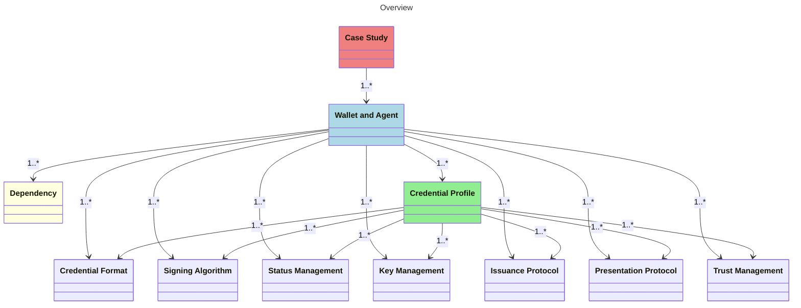

# Digital Wallet and Agent Overviews Special Interest Group (SIG)

The goal of this SIG is to continuously develop and maintain a comprehensive overview of wallets, agents, and more. You can access the overview [here](https://openwallet-foundation.github.io/digital-wallet-and-agent-overviews-sig/). This resource aims to provide transparency regarding the characteristics of wallets and agents, facilitating comparison and informed decision-making for selecting the most suitable wallet for your use case. Additionally, it offers insights into dependencies, algorithms, protocols, and case studies related to wallets and agents.

## Overview

This repository is holding multiple JSON files that are used to generate the overview. The elements are each defined with a JSON Schema that is used to validate the input. The JSON Schema can be found in the `schemas` folder. The resources are stored in the `data` folder, where each resource has its own folder.

### Wallet and Agent Overview

The core of this project is the overview of digital wallets and agents. It should help users to compare different entries based on objective characetristics like supported algorithms or standards.

### Dependencies

Each wallet and agent is capable to link to relevant dependencies like frameworks or libraries that are relevant. The linking will support the overview of the technology stack of the wallet or agent. We encourage developers to only link to relevant dependencies that are specific for the wallet or agent to avoid a long list of dependencies.

The dependencies will be add as a new object in the `dependencies` folder and then linked by the unique filename in each wallet or agent object. To generate the JSON object, you can use the form provided when clicking "Add Dependency" in the upper right corner of the overview.

### Case Studies

We are looking for case studies of the use of wallets and agents in the field. These case studies can be used to show the applicability of the wallets and agents in real life situations. The case studies will be added as a new object in the `case-studies` folder, referencing the wallets or agents by their filename. To generate the JSON object, you can use the form provided when clicking "Add Case Study" in the upper right corner of the overview.

### Credential profiles

When dealing with digital credentials, it is important to know which credential profiles are supported by the wallet or agent. Each profile is based on specific formats, algorithms or protocols. These resources can be compared objectify in an overview to pick the right profile and therefore the best fitting wallet or agent for a specific use case. The content is based on the  [credential format comparison SIG](https://github.com/openwallet-foundation/credential-format-comparison-sig) that got merged into this overview.

## Participating

This SIG is an open group and we welcome new participants. There is no requirement to be a member of the OpenWallet Foundation to participate.

If you are interested in participating, please join the [OpenWallet Foundation Discord](https://discord.gg/fYEbfjWAkP) and participate in the discussion in the [#digital-wallet-and-agent-overviews-sig](https://discord.gg/fYEbfjWAkP) channel.

**Upcoming meetings:**

In case you have an [openprofile](https://openprofile.dev/) with the same mail address as your calendar invitation, you can access all the recordings of the past meetings.

## Contributing

### Why should I add my digital wallet or agent?

We strive to create a comprehensive and unbiased platform where every provider can showcase their solution at no cost. Recognizing the challenge in quantifying subjective aspects, such as user-friendliness, our focus is on objective parameters. These include resource links and compliance with specific standards, ensuring clear, fact-based comparisons. By allowing and encouraging community contributions through pull requests, we maintain an up-to-date and inclusive matrix. Your active participation by submitting updates or new entries is invaluable, as it not only ensures the overview is correct and complete, but also supports a more informed and diverse user base.

### How can I add my digital wallet or agent?

Contributing to the overview can be done through filling in the form provided when clicking "Add Wallet/agent" in the upper right corner of the overview. The created JSON file can be submitted via a GITHUB pull request.

## Target Audience

This overview should be usable by persons and organizations. Anyone willing to use digital wallets or agents for digital credential purposes should be able to objectively compare the characteristics of wallets/agents and create a short-list of candidates for their use case. It can also serve as resource for market awareness and visibility of wallets/agents for wallet/agent vendors.

## Connection to other OWF groups

This SIG was accepted by the TAC on [September 20, 2023](../meetings/2023/2023-09-20.md). See [Digital Wallet and Agent Overviews SIG Proposal](https://github.com/openwallet-foundation/tac/issues/56) for more details.
